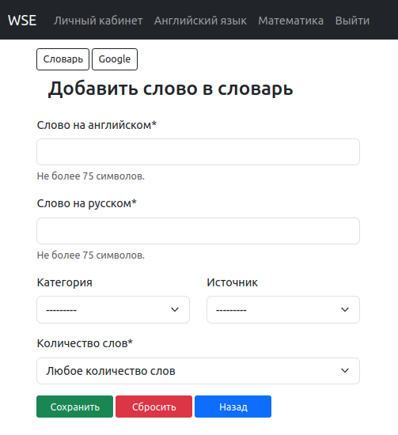

Управление словами
==================

Добавление слова
----------------

Воспользуйтесь панелью меню в верхней части экрана и перейдите в раздел
*"Английский язык"*.

На открывшейся странице, под заголовком *"Словарь"*, нажмите кнопку
*"Добавить слово в словарь"*.

На открывшейся странице, заполните форму добавления слова.

    Рисунок: Страница с формой добавления слова.

    Поля *"Слово на английском"* и *"Слово на русском"*
    обязательны к заполнению.

.. note::

    Следующие поля формы добавления слова предназначены для удобства
    формирования *списка* слов к изучению.

Поле *"Категория"* и *"Источник"* заполнятся путем выбора заранее
сформированного списка *Категорий* и *Источников*.
Эти поля по-умолчанию не заполнены выбором, и не являются обязательными.

    Поле *Категория* - желаемая группировка слов. Например:

        - "Цвета",
        - "Животные".

    Поле *Источник* - группировка слов по месту, в котором встречаются.
    Например:

        - *"All You Need Is Love"* - название песни,
          перевод слов которой вы хотите выучить;
        - *"Sphinx"* - документация библиотеки,
          к которой часто обращаетесь или которую изучаете.

Поле *"Количество слов"* тоже является обязательным, подлежит выбору из списка
и по-умолчанию выбрано *"Любое количество слов"*.

    Формулировка *"Любое количество слов"* включает в себя
    следующие предусмотренные варианты:

        - Слово;
        - Слово сочетание;
        - Часть предложения;
        - Предложение.

Группировка слов по критерию *"Количество слов"* предусмотрена
для возможности изучения перевода слова как в самостоятельном переводе,
так и в контексте предложения.

Дополнительные элементы страницы
^^^^^^^^^^^^^^^^^^^^^^^^^^^^^^^^

Кнопка *"Словарь"* - предусмотрена для удобства перехода в словарь.
К примеру, чтоб проверить по фильтру добавлено ли ранее это слово в словарь,
встречается ли оно в других словосочетаниях.
Об этом подробнее в следующей главе *"Словарь"*

Кнопка *"Google"* - направить вас на страницу "Google translate".
