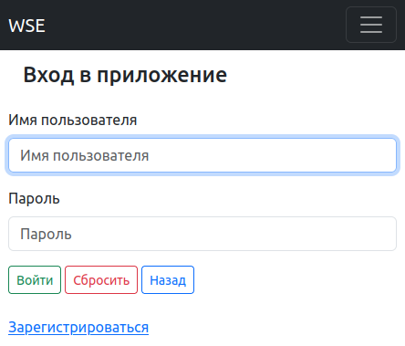

Управление пользователем приложения
===================================

Регистрация пользователя
------------------------

Добавляемые пользователем слова к изучению сохраняются в словарь пользователя.
Чтоб связать формируемый словарь с пользователем, необходима регистрация пользователя.

Для регистрации потребуется только логин и пароль.
В связи с этим, отсутствует возможность восстановления доступа
при забытом логине и (или) пароле пользователя.

Навигация по приложению осуществляется через панель меню в верхней части экрана.
Воспользуйтесь ей и перейдите в раздел "Регистрация".
На обновленной странице заполните форму регистрации.

Для завершения регистрации нажмите кнопку "Зарегистрироваться",
после чего будут проверены введенные вами данные на наличие свободного логина
и на соответствие требованиям безопасности введенных вами данных.

Если регистрация прошла успешно и вы видите сообщение об этом,
это значит, что вы внимательно ознакомились с требованиями безопасности
и желаемый вами логин свободен.
В ином случае, обратите внимание на сообщение приложения.

После регистрации вы будете перенаправлены на страницу входа в приложение.

.. figure:: ../images/auth/page-registration.png

    Рисунок: Страница с формой регистрации.

Вход пользователя в приложение
------------------------------

Воспользуйтесь панелью меню в верхней части экрана и перейдите в раздел "Вход".

После ввода логина и пароля нажмите на кнопку "Вход".

Если вы зарегистрированы и ввели без ошибок, логи и пароль,
то приложение отметит вас как пользователя вошедшего в приложение
и перенаправит на "Домашнюю страницу".
В ином случае, обратите внимание на сообщение приложения.

    Рисунок: Страница с формой входа в приложение.

Выход из приложения
-------------------

Воспользуйтесь панелью меню в верхней части экрана и нажмите "Выход".

После выхода из приложения будет загружена страница входа в приложение.

Удаление пользователя
---------------------

.. note::

    Удаленного пользователя невозможно восстановить.

    С удалением пользователя удалятся все данные, введенные пользователем,
    и сведения, собранные приложением, об изучении пользователем слов.

Воспользуйтесь панелью меню в верхней части экрана и перейдите в  "Личный кабинет".

В нижнем ряду кнопок нажмите кнопку "Удалить".
Вы будите перенаправлены на страницу подтверждения удаления пользователя.
Если вы уверены, что хотите удалить пользователя, нажмите кнопку "Удалить",
в ином случае, кнопку "Назад".

После удаления пользователя вы будите перенаправлены на страницу входа в приложение.
